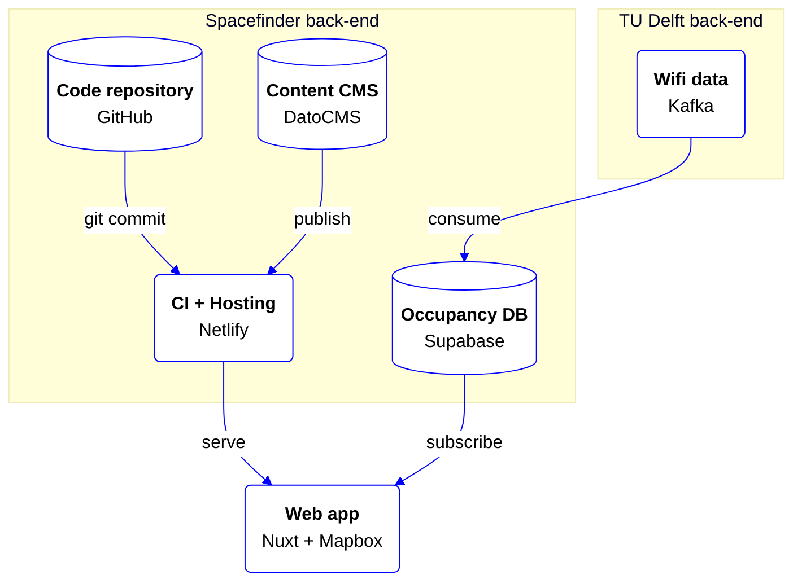
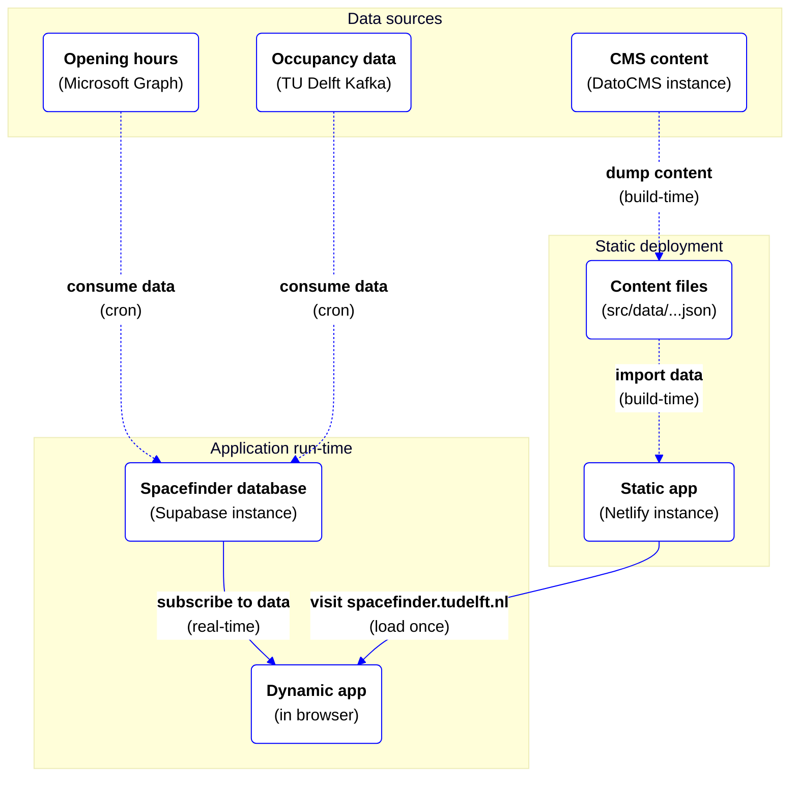

# TU Delft Spacefinder

**App to easily find available spaces on the TU Delft Campus.**

🚀 [spacefinder.tudelft.nl](https://spacefinder.tudelft.nl)

## Architecture

Key technology used in the Spacefinder:

* [Nuxt](https://nuxt.com/) + [Mapbox](https://www.mapbox.com/) for an interactive web app including a map of the campus.
* [Netlify](https://www.netlify.com/) for deployments (CI/CD + hosting).
* [DatoCMS](https://www.datocms.com/) for content management by TU Delft team (see [data](#data)).
* [Supabase](https://supabase.com/) to store and aggregate wifi data for locations (see [data](#data)).

See `tudelft-spacefinder` in Bitwarden for links to the Netlify, DatoCMS and Supabase instances.

### Data
The Spacefinder combines data from different sources:

* **Locations**: the TU Delft provides a list of locations as a CSV file. The file is generated from a system of TU Delft Education and Student Affairs (ESA) and emailed to the Spacefinder team. The location data is stored in the codebase (`src/data/studieplekken.csv`) and compiled into useable files (`src/data/buildings.json` and `spaces.json`) during build-time.
* **Content**: a DatoCMS instance is used for enriching building content and managing the rich text content used in the application. The use of a CMS makes this content easily editable by (TU Delft members of) the Spacefinder team. The content data is dumped during build-time (`src/data/*page.json`), so there's no run-time dependency on the CMS.
* **Opening hours**: the TU Delft provides opening hours for (some) buildings and spaces via a Microsoft Graph API.
* **Occupancy data**: the TU Delft provides real-time data on location occupancy via a Kafka stream. The stream contains device counts for wifi access points on the TU Delft campus. Since the data is continuously updated, it's handled during run-time. The Spacefinder consumes this data every 5 minutes via a serverless function and stores it in a Supabase database. The database contains triggers to convert device counts per wifi access point to device counts per space and per building. The client-side Spacefinder app subscribes to the device counts per space and building and displays them in the UI.

The data sources and data flow is visualised in the diagram below:

### Decision log
Key decisions that are made during the course of the project are documented in [docs/decision-log/](docs/decision-log/). Please read the log so you understand why decisions are made and document key decisions when you make them.

---

## Development

### Requirements
- [Node.js](http://nodejs.org/) (see [`.nvmrc`](.nvmrc) for correct version).
- [Docker](https://www.docker.com/) to run Supabase locally.

### Getting started
* Clone the repository.
* Run `npm ci` to install the dependencies.
* Copy `.env.example` to `.env` and set the environment variables. Copy them from `tudelft-spacefinder` in Bitwarden or ask a dev team member. 
* Run app in development mode (`npm run dev`), see all scripts with `npm run`.

#### Local Supabase
In order to make changes to the database schema a local Supabase instance is needed.
* Login with `npx supabase login`.
* Run `npm run supabase:start` to start a local Supabase instance.
* Use the output API url and key to set the environment variables `SUPABASE_URL` & `SUPABASE_KEY`.

#### Migration
* After changing the database schema run `npm run supabase:db:diff` followed by a migration name, e.g. `npm run supabase:db:diff -- create_xyz`.
* Possibly alter the seeding data to match the schema changes.
* Reset the local database to ensure everything works with `npm run supabase:db:reset`.
* Committed migrations that are merged to the main branch are automatically deployed.
