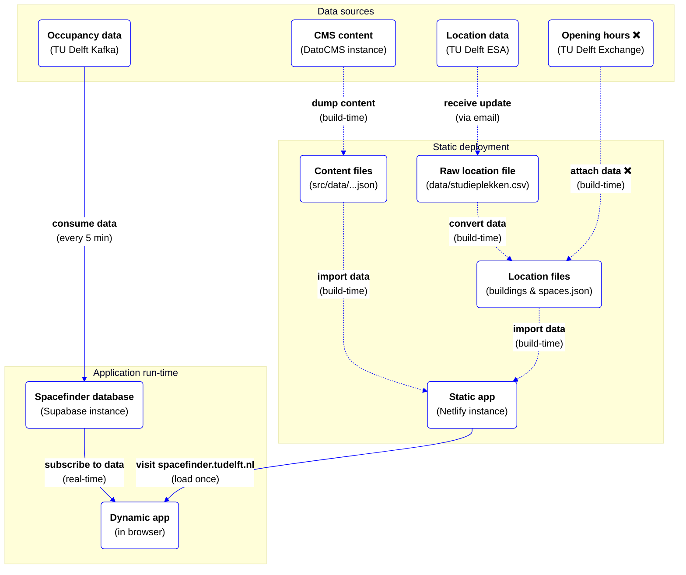

# tudelft-spacefinder
> App to easily find available spaces on the TU Delft Campus.

This app is a universal [Vue.js](https://vuejs.org/) app made with [Nuxt](https://nuxt.com/). The app has multi-language support (English and Dutch).

## Development

### Requirements
- [Node.js](http://nodejs.org/)
- [Docker](https://www.docker.com/) if running Supabase locally

### Getting started
* Clone the repository.
* Run `npm ci` to install the dependencies.
* Copy `.env.example` to `.env` and set the environment variables. Copy them from the [Netlify settings](https://app.netlify.com/sites/spacefinder/settings/general) or ask a dev team member. 
* Run app in development mode (`npm run dev`), see all scripts with `npm run`.

#### Local Supabase
In order to make changes to the database schema a local Supabase instance is needed.
* Login with `npx supabase login`.
* Run `npm run supabase:start` to start a local Supabase instance.
* Use the output API url and key to set the environment variables `SUPABASE_URL` & `SUPABASE_KEY`.

#### Migration
* After changing the database schema run `npm run supabase:db:diff` followed by a migration name, e.g. `npm run supabase:db:diff -- create_xyz`.
* Possibly alter the seeding data to match the schema changes.
* Reset the local database to ensure everything works with `npm run supabase:db:reset`.
* Committed migrations that are merged to the main branch are automatically deployed.

### Data
The Spacefinder combines data from different sources:

* **Locations**: the TU Delft provides a list of locations as a CSV file (`data/studieplekken.csv`). The file is generated from a system of TU Delft Education and Student Affairs (ESA) and emailed to the Spacefinder team. Since new CSV files are rarely received, the location data is stored in the codebase and compiled into useable files (`src/data/buildings.json` and `spaces.json`) during build-time. The TU Delft plans to make the location data available through a TopDesk API in the future, but there is no timeline available.
* **Content**: a DatoCMS instance is used for enriching building content and managing the rich text content used in the application. The use of a CMS makes this content easily editable by (TU Delft members of) the Spacefinder team. The content data is dumped during build-time (`src/data/*page.json`), so there's no run-time dependency on the CMS.
* **Opening hours**: the TU Delft provides opening hours for (some) buildings and spaces via a Microsoft Exchange web service. ~~The Spacefinder app was originally developed as a static generated website. Opening hours were therefore also added to the locations during build-time. Since, the Spacefinder does not receive updates on changes in opening hours, a cron job is used to trigger a nightly build (`.github/workflows/scheduled-build.yml`).~~ ❌ The Exchange web service is currently unavailable due to expired credentials. The Spacefinder team is waiting for TU Delft support. The opening hours are therefore hidden in the UI (`HIDE_OPENING_HOURS=1`) and the nightly build has been disabled.
* **Occupancy data**: the TU Delft provides real-time data on location occupancy via a Kafka stream. The stream contains device counts for wifi access points on the TU Delft campus. Since the data is continuously updated, it's handled during run-time. The Spacefinder consumes this data every 5 minutes via a serverless function and stores it in a Supabase database. The database contains triggers to convert device counts per wifi access point to device counts per space and per building. The client-side Spacefinder app subscribes to the device counts per space and building and displays them in the UI.

The data sources and data flow is visualised in the diagram below:

### Decision log
Key decisions that are made during the course of the project are documented in [docs/decision-log/](docs/decision-log/). Please read the log so you understand why decisions are made and document key decisions when you make them.
